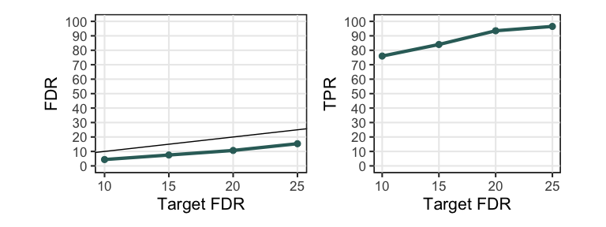

---
output:
  html_document:
    variant: markdown_github
    keep_md: yes
  md_document:
    variant: markdown_github
  pdf_document: default
---

<!-- README.md is generated from README.Rmd. Please edit that file -->


# tknock
**Title**: The T-Knock filter for fast high-dimensional variable selection with FDR control

**Description**: It performs fast variable selection in large-scale high-dimensional settings while controlling the false discovery rate (FDR) at a user-defined target level. The package is based on the T-Knock filter paper (available at https://arxiv.org/abs/2110.06048).

**Note**: The T-Rex selector performs terminated-random experiments (T-Rex) using the T-LARS algorithm ([R package](https://github.com/jasinmachkour/tlars)) and fuses the selected active sets of all random experiments to obtain a final set of selected variables. The T-Rex selector provably controls the false discovery rate (FDR), i.e., the expected fraction of selected false positives among all selected variables, at the user-defined target level while maximizing the number of selected variables and, thereby, achieving a high true positive rate (TPR) (i.e., power). The T-Rex selector can be applied used in various fields, such as genomics, financial engineering, or any other field that requires a fast and FDR-controlling variable/feature selection method for large-scale high-dimensional settings.

In the following, we show how to use the package and show you how genome-wide association studies (GWAS) can be performed using the T-Rex selector. 

## Installation

Before installing the tknock package, you need to install the required tlars package. You can install the tlars package from [GitHub](https://github.com/jasinmachkour/tlars) with 

``` r
install.packages("devtools")
devtools::install_github("jasinmachkour/tlars")
```

Then, you can install the tknock package with:

``` r
devtools::install_github("jasinmachkour/tknock")
```

You can open the help pages with

```r
library(tknock)
help(package = "tknock")
?tknock
?random_experiments
?lm_dummy
?add_dummies
?add_dummies_GVS
?FDP
?TPP
# etc.
```

To cite the package ‘tknock’ in publications use:

```r
citation("tknock")
```

## Quick Start
In the following, we illustrate the basic usage of the tknock package to perform FDR-controlled variable selection in large-scale high-dimensional settings using the T-Rex selector:

1. **First**, we generate a high-dimensional Gaussian data set with sparse support:


```r
library(tknock)

# Setup
n <- 75 # Number of observations
p <- 150 # Number of variables
num_act <- 3 # Number of true active variables
beta <- c(rep(1, times = num_act), rep(0, times = p - num_act)) # Coefficient vector
true_actives <- which(beta > 0) # Indices of true active variables
num_dummies <- p # Number of dummy predictors (or dummies)

# Generate Gaussian data
set.seed(123)
X <- matrix(stats::rnorm(n * p), nrow = n, ncol = p)
y <- X %*% beta + stats::rnorm(n)
```

2. **Second**, we perform FDR-controlled variable selection using the T-Rex selector with a target FDR of 10 %:


```r
# Seed
set.seed(1234)

# Numerical zero
eps <- .Machine$double.eps

# Variable selection via T-Rex
res <- tknock(X = X, y = y, tFDR = 0.1)
#> 
#>  Appended dummies: 150 
#> 
#>  Appended dummies: 300 
#> 
#>  Appended dummies: 450 
#> 
#>  Appended dummies: 600 
#> 
#>  Included dummies before stopping: 2 
#> 
#>  Included dummies before stopping: 3 
#> 
#>  Included dummies before stopping: 4 
#> 
#>  Included dummies before stopping: 5 
#> 
#>  Included dummies before stopping: 6 
#> 
#>  Included dummies before stopping: 7 
#> 
#>  Included dummies before stopping: 8 
#> 
#>  Included dummies before stopping: 9 
#> 
#>  Included dummies before stopping: 10 
#> 
#>  Included dummies before stopping: 11 
#> 
#>  Included dummies before stopping: 12 
#> 
#>  Included dummies before stopping: 13 
#> 
#>  Included dummies before stopping: 14 
#> 
#>  Included dummies before stopping: 15 
#> 
#>  Included dummies before stopping: 16 
#> 
#>  Included dummies before stopping: 17 
#> 
#>  Included dummies before stopping: 18 
#> 
#>  Included dummies before stopping: 19 
#> 
#>  Included dummies before stopping: 20 
#> 
#>  Included dummies before stopping: 21 
#> 
#>  Included dummies before stopping: 22 
#> 
#>  Included dummies before stopping: 23 
#> 
#>  Included dummies before stopping: 24 
#> 
#>  Included dummies before stopping: 25 
#> 
#>  Included dummies before stopping: 26 
#> 
#>  Included dummies before stopping: 27 
#> 
#>  Included dummies before stopping: 28 
#> 
#>  Included dummies before stopping: 29 
#> 
#>  Included dummies before stopping: 30 
#> 
#>  Included dummies before stopping: 31 
#> 
#>  Included dummies before stopping: 32 
#> 
#>  Included dummies before stopping: 33 
#> 
#>  Included dummies before stopping: 34 
#> 
#>  Included dummies before stopping: 35 
#> 
#>  Included dummies before stopping: 36 
#> 
#>  Included dummies before stopping: 37 
#> 
#>  Included dummies before stopping: 38
selected_var <- which(res$selected_var > eps)
paste("True active variables: ", as.character(true_actives), collapse = ", ")
#> [1] "True active variables:  1, True active variables:  2, True active variables:  3"
paste("Selected variables: ", as.character(selected_var), collapse = ", ")
#> [1] "Selected variables:  1, Selected variables:  2, Selected variables:  3"
```

So, with a target FDR of 10%, the T-Rex selector has selected all true active variables and there is no false positive in this example.

Note that users have to specify the target FDR according to the requirements of their specific applications.

3. **Third**, we look at the behavior of the T-Rex selector for different choices of the target FDR. We conduct Monte Carlo simulations and plot the resulting averaged FDP and TPP over the target FDR. Note that the averaged FDP and TPP are estimates of the FDR and TPR, respectively:


```r
# Computations might take up to 10 minutes... Please wait... 

# Numerical zero
eps <- .Machine$double.eps

# Seed
set.seed(1234)

# Setup
n <- 100 # number of observations
p <- 150 # number of variables

# Parameters
num_act <- 10 # number of true active variables
beta <- rep(0, times = p) # coefficient vector (all zeros first)
beta[sample(seq(p), size = num_act, replace = FALSE)] <- 1 # coefficient vector (active variables with non-zero coefficients)
true_actives <- which(beta > 0) # indices of true active variables
tFDR_vec <- c(0.1, 0.15, 0.2, 0.25) # target FDR levels
MC <- 100 # number of Monte Carlo runs per stopping point

# Initialize results vectors
FDP <- matrix(NA, nrow = MC, ncol = length(tFDR_vec))
TPP <- matrix(NA, nrow = MC, ncol = length(tFDR_vec))

# Run simulations
for (t in seq_along(tFDR_vec)) {
  for (mc in seq(MC)) {
    # Generate Gaussian data
    X <- matrix(stats::rnorm(n * p), nrow = n, ncol = p)
    y <- X %*% beta + stats::rnorm(n)
    
    # Run T-Rex selector
    res <- tknock(X = X, y = y, tFDR = tFDR_vec[t], verbose = FALSE)
    selected_var <- which(res$selected_var > eps)
    
    # Results
    FDP[mc, t] <- length(setdiff(selected_var, true_actives)) / max(1, length(selected_var))
    TPP[mc, t] <- length(intersect(selected_var, true_actives)) / max(1, length(true_actives))
  }
}
# Compute estimates of FDR and TPR by averaging FDP and TPP over MC Monte Carlo runs
FDR <- colMeans(FDP)
TPR <- colMeans(TPP)
```



We observe that with growing target FDR the FDR and TPR increase. Moreover, we see that the T-Rex selector always controls the FDR (green line is always below the black reference line, i.e., maximum allowed value for the FDR). For more details and discussions on these observations, we refer the interested reader to [@machkour2021terminating].

## Documentation
For more information and some examples, please check the ...

## Links
T-Rex paper: https://arxiv.org/abs/2110.06048

trex package: [GitHub-trex](https://github.com/jasinmachkour/tknock).

README file: 

Vignette:

tlars package: [GitHub-tlars](https://github.com/jasinmachkour/tlars).
