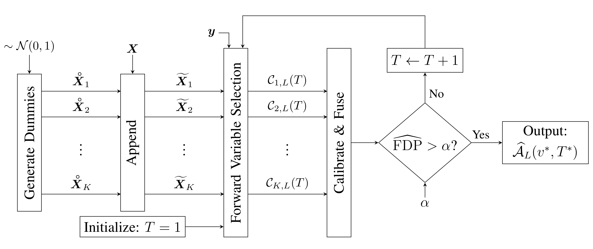
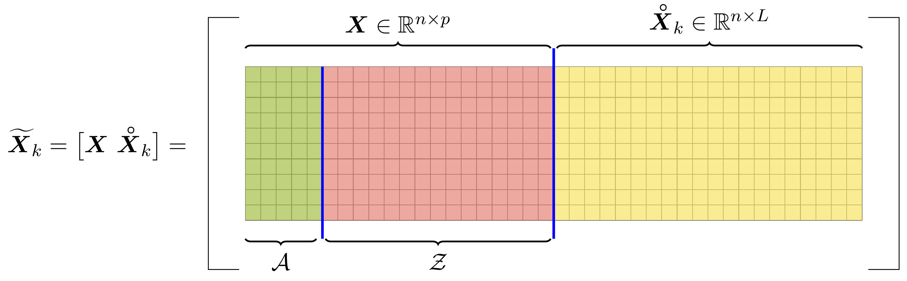

```{r, include = FALSE}
library(knitr)
knitr::opts_chunk$set(
  collapse = TRUE,
  comment = "#>",
  fig.align = "center",
  fig.retina = 2,
  out.width = "85%",
  dpi = 96
  # pngquant = "--speed=1"
)
options(width=80)
# knit_hooks$set(pngquant = hook_pngquant)
```

-----------
> This vignette illustrates the basic usage of the package [`tknock`] (GithubLink)
for performing high-dimensional variable selection while controlling a user-defined 
target false discovery rate (target FDR).


```{r setup}
library(tknock)
```

# The T-Knock Framework

```{r TKnockFramework, echo=FALSE, fig.cap="Figure 1: Simplified overview of the T-Knock framework.", out.width = '100%'}

```
<br>
<br>
<br>
```{r EnlargedPredictorMatrix, echo=FALSE, fig.cap="Figure 2: The enlarged predictor matrix (predictor matrix with knockoffs).", out.width = '100%'}

```

# Relative Occurrences

# Deflated Relative Occurrences

# Conservative FDP Estimator

# Algorithms

# References {-}


