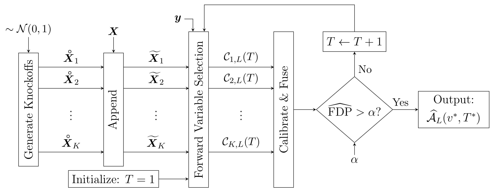
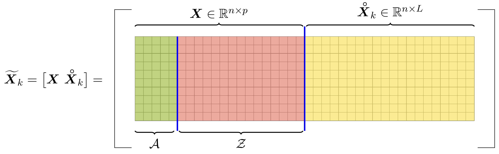

```{r, include = FALSE}
library(knitr)
knitr::opts_chunk$set(
  collapse = TRUE,
  comment = "#>",
  fig.align = "center",
  fig.retina = 2,
  out.width = "85%",
  dpi = 96
  # pngquant = "--speed=1"
)
options(width = 80)
```


-----------
# Motivation
The T-Rex selector performs fast variable selection in large-scale high-dimensional settings. It performs terminated-random experiments (T-Rex) using the T-LARS algorithm ([R package](https://github.com/jasinmachkour/tlars)) and fuses the selected active sets of all random experiments to obtain a final set of selected variables. The T-Rex selector provably controls the false discovery rate (FDR), i.e., the expected fraction of selected false positives among all selected variables, at the user-defined target level while maximizing the number of selected variables and, thereby, achieving a high true positive rate (TPR) (i.e., power). The T-Rex selector can be applied in various fields, such as genomics, financial engineering, or any other field that requires a fast and FDR-controlling variable/feature selection method for large-scale high-dimensional settings.

In the following, we show how to use the package and show you how genome-wide association studies (GWAS) can be performed using the T-Rex selector.

<!-- Include Latex macros -->
$$
\DeclareMathOperator{\FDP}{FDP}
\DeclareMathOperator{\FDR}{FDR}
\DeclareMathOperator{\TPP}{TPP}
\DeclareMathOperator{\TPR}{TPR}
\newcommand{\A}{\mathcal{A}}
\newcommand{\X}{\boldsymbol{X}}
\newcommand{\XWK}{\boldsymbol{\tilde{X}}}
\newcommand{\C}{\mathcal{C}}
\newcommand{\coloneqq}{\mathrel{\vcenter{:}}=}
$$

# Installation
Before installing the tknock package, you need to install the required tlars package. You can install the tlars package from [GitHub](https://github.com/jasinmachkour/tlars) with 

``` r
install.packages("devtools")
devtools::install_github("jasinmachkour/tlars")
```

Then, you can install the tknock package with:

``` r
devtools::install_github("jasinmachkour/tknock")
```

You can open the help pages with
```{r, eval=FALSE}
library(tknock)
help(package = "tknock")
?tknock
?random_experiments
?lm_dummy
?add_dummies
?add_dummies_GVS
?FDP
?TPP
# etc.
```

To cite the package ‘tknock’ in publications use:
```{r, eval=FALSE}
citation("tknock")
```

# Quick Start
In the following, we illustrate the basic usage of the tknock package to perform FDR-controlled variable selection in large-scale high-dimensional settings using the T-Rex selector:

1. **First**, we generate a high-dimensional Gaussian data set with sparse support:

```{r}
library(tknock)

# Setup
n <- 75 # Number of observations
p <- 150 # Number of variables
num_act <- 3 # Number of true active variables
beta <- c(rep(1, times = num_act), rep(0, times = p - num_act)) # Coefficient vector
true_actives <- which(beta > 0) # Indices of true active variables
num_dummies <- p # Number of dummy predictors (or dummies)

# Generate Gaussian data
set.seed(123)
X <- matrix(stats::rnorm(n * p), nrow = n, ncol = p)
y <- X %*% beta + stats::rnorm(n)
```

2. **Second**, we perform FDR-controlled variable selection using the T-Rex selector with a target FDR of 5%:

```{r}
# Seed
set.seed(1234)

# Numerical zero
eps <- .Machine$double.eps

# Variable selection via T-Rex
res <- tknock(X = X, y = y, tFDR = 0.05, verbose = FALSE)
selected_var <- which(res$selected_var > eps)
paste0("True active variables: ", paste(as.character(true_actives), collapse = ", "))
paste0("Selected variables: ", paste(as.character(selected_var), collapse = ", "))
```

So, with a target FDR of 5%, the T-Rex selector has selected all true active variables and there is no false positive in this example.

Note that users have to specify the target FDR according to the requirements of their specific applications.

# FDR and TPR
## False discovery rate (FDR) and true positive rate (TPR)
In the following, we give a mathematical definition of two important metrics in variable selection: the false discovery rate (FDR) and the true positive rate (TPR):

**Definitions** (FDR and TPR)
Let $\widehat{\A} \subseteq \lbrace 1, \ldots, p \rbrace$ be the set of selected variables, $\A \subseteq \lbrace 1, \ldots, p \rbrace$ the set of true active variables, $| \widehat{\A} |$ the cardinality of $\widehat{\A}$, and define $1 \lor a \coloneqq \max\lbrace 1, a \rbrace$, $a \in \mathbb{R}$. Then, the false discovery rate (FDR) and the true positive rate (TPR) are defined by
$$
\FDR \coloneqq \mathbb{E} \big[ \FDP \big] \coloneqq \mathbb{E} \left[ \dfrac{\big| \widehat{\A} \backslash \A \big|}{1 \lor \big| \widehat{\A} \big|} \right]
$$
and 

$$
\TPR \coloneqq \mathbb{E} \big[ \TPP \big] \coloneqq \mathbb{E} \left[ \dfrac{| \A  \cap \widehat{\A} |}{1 \lor | \A |} \right],
$$
respectively.

# Simulations
Let us have a look at the behavior of the T-Rex selector for different choices of the target FDR. We conduct Monte Carlo simulations and plot the resulting averaged FDP and TPP over the target FDR. Note that the averaged FDP and TPP are estimates of the FDR and TPR, respectively:

```{r}
# Computations might take up to 10 minutes... Please wait... 

# Numerical zero
eps <- .Machine$double.eps

# Seed
set.seed(1234)

# Setup
n <- 100 # number of observations
p <- 150 # number of variables

# Parameters
num_act <- 10 # number of true active variables
beta <- rep(0, times = p) # coefficient vector (all zeros first)
beta[sample(seq(p), size = num_act, replace = FALSE)] <- 1 # coefficient vector (active variables with non-zero coefficients)
true_actives <- which(beta > 0) # indices of true active variables
tFDR_vec <- c(0.1, 0.15, 0.2, 0.25) # target FDR levels
MC <- 100 # number of Monte Carlo runs per stopping point

# Initialize results vectors
FDP <- matrix(NA, nrow = MC, ncol = length(tFDR_vec))
TPP <- matrix(NA, nrow = MC, ncol = length(tFDR_vec))

# Run simulations
for (t in seq_along(tFDR_vec)) {
  for (mc in seq(MC)) {
    
    # Generate Gaussian data
    X <- matrix(stats::rnorm(n * p), nrow = n, ncol = p)
    y <- X %*% beta + stats::rnorm(n)
    
    # Run T-Rex selector
    res <- tknock(X = X, y = y, tFDR = tFDR_vec[t], verbose = FALSE)
    selected_var <- which(res$selected_var > eps)
    
    # Results
    FDP[mc, t] <- length(setdiff(selected_var, true_actives)) / max(1, length(selected_var))
    TPP[mc, t] <- length(intersect(selected_var, true_actives)) / max(1, length(true_actives))
  }
}

# Compute estimates of FDR and TPR by averaging FDP and TPP over MC Monte Carlo runs
FDR <- colMeans(FDP)
TPR <- colMeans(TPP)
```

```{r FDR_and_TPR, echo=FALSE, fig.align='center', message=FALSE, fig.width=12, fig.height=5, out.width = "95%"}
# Plot results
library(ggplot2)
library(patchwork)
tFDR_vec_percent <- 100 * tFDR_vec
plot_data <- data.frame(tFDR_vec = tFDR_vec_percent,
                        FDR = 100 * FDR,
                        TPR = 100 * TPR) # data frame containing data to be plotted (FDR and TPR in %)

# FDR vs. tFDR
FDR_vs_tFDR <-
  ggplot(plot_data, aes(x = tFDR_vec_percent, y = FDR)) +
    labs(x = "Target FDR",
         y = "FDR") +
    scale_x_continuous(breaks = tFDR_vec_percent, minor_breaks = c(), limits = c(tFDR_vec_percent[1], tFDR_vec_percent[length(tFDR_vec_percent)])) +
    scale_y_continuous(breaks = seq(0, 100, by = 10), minor_breaks = c(), limits = c(0, 100)) +
    geom_line(size = 1.5, colour = "#336C68") +
    geom_abline(slope = 1) +
    geom_point(size = 2.5, colour = "#336C68") +
    theme_bw(base_size = 16) +
    theme(panel.background = element_rect(fill = "white", color = "black", size = 1)) +
    coord_fixed(ratio =  0.75 * (tFDR_vec_percent[length(tFDR_vec_percent)] - tFDR_vec_percent[1]) / (100 - 0))

# TPR vs. tFDR
TPR_vs_tFDR <- 
  ggplot(plot_data, aes(x = tFDR_vec_percent, y = TPR)) +
    labs(x = "Target FDR",
         y = "TPR") +
    scale_x_continuous(breaks = tFDR_vec_percent, minor_breaks = c(), limits = c(tFDR_vec_percent[1], tFDR_vec_percent[length(tFDR_vec_percent)])) +
    scale_y_continuous(breaks = seq(0, 100, by = 10), minor_breaks = c(), limits = c(0, 100)) +
    geom_line(size = 1.5, colour = "#336C68") +
    geom_point(size = 2.5, colour = "#336C68") +
    theme_bw(base_size = 16) +
    theme(panel.background = element_rect(fill = "white", color = "black", size = 1)) +
    coord_fixed(ratio =  0.75 * (tFDR_vec_percent[length(tFDR_vec_percent)] - tFDR_vec_percent[1]) / (100 - 0))
FDR_vs_tFDR + TPR_vs_tFDR
```

We observe that with growing target FDR the FDR and TPR increase. Moreover, we see that the T-Rex selector always controls the FDR (green line is always below the black reference line, i.e., maximum allowed value for the FDR). For more details and discussions on these observations, we refer the interested reader to the original T-Rex paper [@machkour2021terminating].

# Simulated GWAS

# The T-Knock Framework
The general steps that define the \textit{T-Knock} framework are illustrated in Figure 1. The key idea is to design randomized controlled experiments where fake variables, so-called dummies, act as a negative control group in the variable selection process.

```{r TKnockFramework, echo=FALSE, fig.cap="Figure 1: Simplified overview of the T-Knock framework.", out.width = '85%'}

```

Within the \textit{T-Knock} framework, a total of $K$ random experiments with independently generated dummy matrices are conducted. Figure 2 shows the structure of the enlarged predictor matrix. Without loss of generality, true active variables (green) and non-active variables (red) are represented to be clearly separated within the predictor matrix. Note that, we illustrate the enlarged predictor in this structured fashion for reasons of simplicity. In practice, this is rarely the case. The dummy variables (yellow) compete with the given input variables in $\X$ to be included by a forward variable selection method, such as the LARS algorithm [@efron2004least] or the Lasso [@tibshirani1996regression]. In each random experiment, the solution path is terminated early, as soon as a pre-defined number of $T$ knockoffs is included in the model. This results in the $K$ candidate sets $\C_{1, L}(T), \ldots, \C_{K, L}(T)$. The early stopping leads to a drastic reduction in computation time for sparse problems, where continuing leads to including more null-variables. Finally, a voting scheme is applied to the candidate sets which yields the final active set $\widehat{\A}_{L}(v^{*}, T^{*})$. The calibration process, that is not described in detail here, ensures that the number of included knockoffs $T^{*}$ after which the forward selection process is terminated and the voting level $v^{*}$ are determined such that the FDR is controlled at the user-defined target FDR level $\alpha$.

```{r EnlargedPredictorMatrix, echo=FALSE, fig.cap="Figure 2: The enlarged predictor matrix (predictor matrix with dummies).", out.width = '65%'}

```

For a more detailed description of Figures 1 and 2 and more details on the T-Rex selector in general, we refer the interested reader to the original paper [@machkour2021terminating].

# References {-}
<!-- <div class="tocify-extend-page" data-unique="tocify-extend-page" style="height: 0px;"></div> -->


